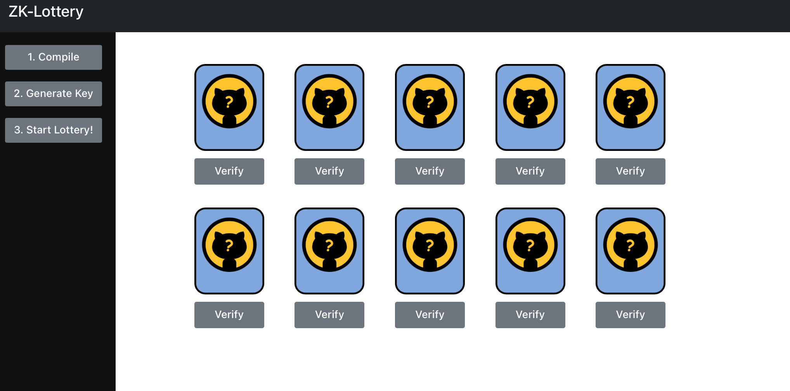

# Zk-Lottery


A lottery system using ZK-SNARKS for verification.
## Setup
```
git clone https://github.com/hsingwenhsu/zk-lottery.git

cd zk-lottery
# install the packages for the front-end server
npm install

# install the packages for the back-end server
cd api
npm install
```
## How to run?
### Run the front-end server
```
npm run start
```
### Run the back-end server 
```
cd api
npm run start
```
### Component
* **Compile** bottom: compiling the reveal_bit.zok
* **Generate Key** bottom: generating proof key and verification key
* **Start Lottery** bottom: sent the secret to the front-end and initialize the status of the cards
* **Cards**: the lottery item, reveal with head or tail when clicking
* **verify** bottom: generate the proof and verify with verification key

## Reference
* Zokrates: [https://zokrates.github.io](https://zokrates.github.io)